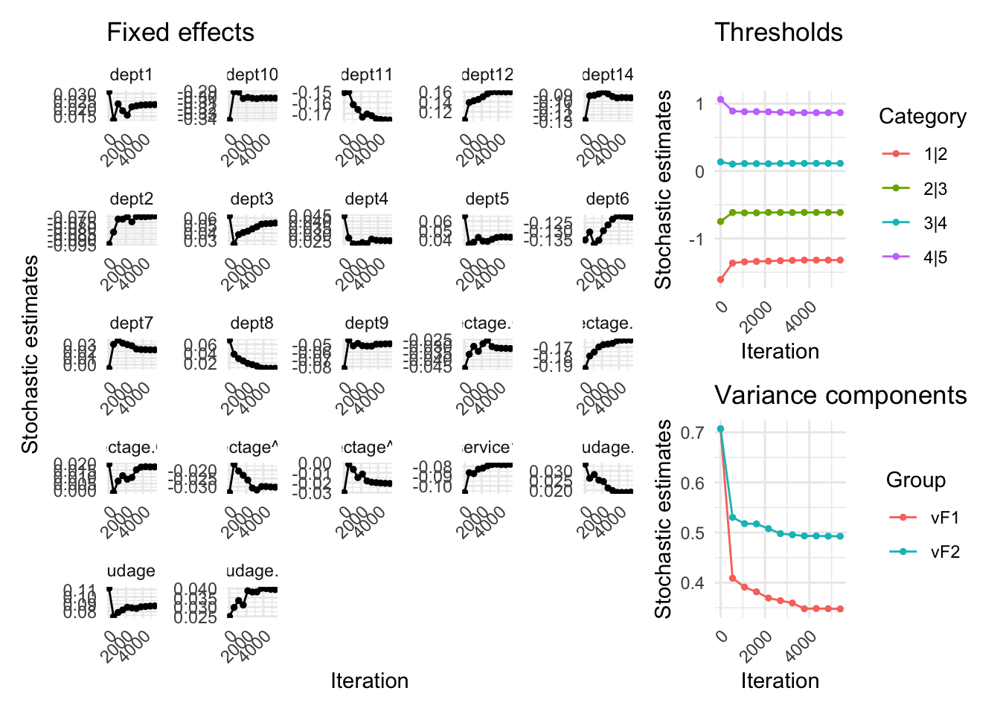

<!-- README.md is generated from README.Rmd. Please edit that file -->

# SPL

<!-- badges: start -->

[](https://lifecycle.r-lib.org/articles/stages.html#experimental)
[](https://CRAN.R-project.org/package=SPL)
<!-- badges: end -->

The SPL package allows to estimate cross random effects model for binary
and ordinal responses via pairwise likelihood. When dealing with
small-to-moderate data dimensions, it is possible to use standard
pairwise likelihood. In case of massive datasets, we suggest using
stochastic pairise likelihood.

## Installation

You can install the development version of SPL via

``` r
devtools::install_github("giuseppealfonzetti/SPL")
```

## Example

``` r
library(SPL)

data(InstEval, package = "lme4")
N <- nrow(InstEval); R <- length(unique(InstEval$s)); C <- length(unique(InstEval$d))
N; R; C;
#> [1] 73421
#> [1] 2972
#> [1] 1128

mod.polr <- MASS::polr(
    factor(y) ~ studage + lectage + service + dept,
    method = "probit",
    data = InstEval
  )
y <- InstEval$y
x <- model.matrix(mod.polr)[, -1]
init <- c(mod.polr$zeta, mod.polr$coefficients, 0.25, 0.25)

tictoc::tic()
saFIT <- saPL(
    Y = as.numeric(y),
    X = x,
    F1 = InstEval$s,
    F2 = InstEval$d,
    START = init,
    MODEL = "ordprobit",
    VERBOSE = 2
  )
#> Pairs F1: 1213154 , Pairs F2: 5886370 
#> Starting...
#> Updates per cycle: 24473, pairs per dimension: 8
#> Iter: 10000
#> Iter: 20000
#> End of cycle: 0| mean abs theta pdiff from prev cycle: 0.347651
#> Iter: 30000
#> Iter: 40000
#> End of cycle: 1| mean abs theta pdiff from prev cycle: 0.0587675
#> Burn-in ended
#> Iter: 50000
#> Iter: 60000
#> Iter: 70000
#> End of cycle: 2| mean abs theta pdiff from prev cycle: 0.0146225
#> Ended
tictoc::toc()
#> 24.621 sec elapsed
```

``` r
plot_sa_traj(saFIT)
```


