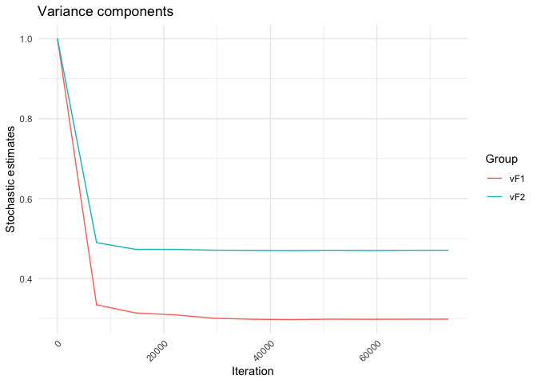

<!-- README.md is generated from README.Rmd. Please edit that file -->

# SPL

<!-- badges: start -->

<!-- badges: end -->

The SPL package allows to estimate cross random effects model for binary
and ordinal responses via pairwise likelihood. When dealing with
small-to-moderate data dimensions, it is possible to use standard
pairwise likelihood. In case of massive datasets, we suggest using
stochastic pairise likelihood.

## Installation

You can install the development version of SPL via

    devtools::install_github("giuseppealfonzetti/SPL")

## Example Ordinal

    library(SPL)

    data(InstEval, package = "lme4")
    N <- nrow(InstEval); R <- length(unique(InstEval$s)); C <- length(unique(InstEval$d))
    N; R; C;
    #> [1] 73421
    #> [1] 2972
    #> [1] 1128

    x <- model.matrix(formula("y ~ studage + lectage + service + dept"), data=InstEval)[, -1]

    saFIT <- saPL(
        Y = as.numeric(InstEval$y),
        X = x,
        F1 = InstEval$s,
        F2 = InstEval$d,
        MODEL = "ordprobit",
        VERBOSE = 1
      )
    #> Pairs F1: 1213154 , Pairs F2: 5886370 
    #> Starting...
    #> Updates per cycle: 7342, pairs per dimension: 16
    #> End of cycle: 0| max abs theta pdiff from prev cycle: inf
    #> End of cycle: 1| max abs theta pdiff from prev cycle: 0.363935
    #> End of cycle: 2| max abs theta pdiff from prev cycle: 0.471545
    #> End of cycle: 3| max abs theta pdiff from prev cycle: 0.204541
    #> End of cycle: 4| max abs theta pdiff from prev cycle: 0.0747992
    #> End of cycle: 5| max abs theta pdiff from prev cycle: 0.065153
    #> End of cycle: 6| max abs theta pdiff from prev cycle: 0.149422
    #> End of cycle: 7| max abs theta pdiff from prev cycle: 0.227528
    #> Burn-in ended
    #> End of cycle: 8| max abs theta pdiff from prev cycle: 0.0150302
    #> End of cycle: 9| max abs theta pdiff from prev cycle: 0.0232606
    #> Ended

    plot_sa_traj(saFIT)

